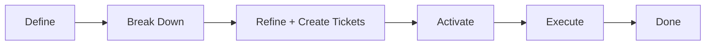
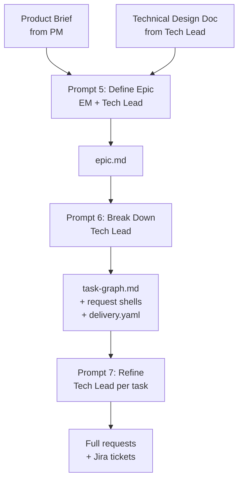
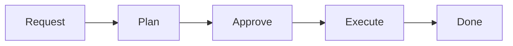

# Development Guide: Spec-Driven Agent Workflow

This document describes the development workflow used in this project. It follows a **Spec-Driven Development (SDD)** model where AI agents plan and implement tasks under human supervision. Every meaningful decision goes through a human approval gate.

> **Note:** This guide is part of the [SDD Boilerplate](../README.md). It is designed to be adopted as-is into new projects. Project-specific details live in `agent-development/agent-specs/` and `config/teams.yaml`.
>
> **Team flow:** For the end-to-end squad choreography integrating Figma, Jira, and GitHub, see [SQUAD_FLOW.md](./SQUAD_FLOW.md).
>
> **First time here?** If you're setting up SDD in an existing repo, start with [ADOPTION.md](../ADOPTION.md) — it covers the full bootstrapping sequence including `bin/dev` setup, `commands.yaml` configuration, and the order of operations.

---

## Table of Contents

- [Philosophy](#philosophy)
- [Directory Layout](#directory-layout)
- [The Epic Layer](#the-epic-layer)
  - [Roles & Responsibilities (RACI)](#roles--responsibilities-raci)
  - [Input Requirements Per Phase](#input-requirements-per-phase)
  - [The Prompt Chain: Data Flow](#the-prompt-chain-data-flow)
  - [Mid-Flight Amendments (Prompt 8)](#mid-flight-amendments-prompt-8)
- [The Pipeline](#the-pipeline)
- [The Quick Fix Track](#the-quick-fix-track)
- [Plan Structure](#plan-structure)
- [File Lifecycle](#file-lifecycle)
- [The Open Questions Mechanism](#the-open-questions-mechanism)
- [Git Workflow & Commits](#git-workflow--commits)
- [Prompt Templates](#prompt-templates)
- [Document Templates](#document-templates)
- [Project Specs](#project-specs)
- [Conventions](#conventions)
- [Quick Reference: Common Actions](#quick-reference-common-actions)

---

## Philosophy

This project follows a **spec-driven development** model:

1. **Humans define *what* to build** — through task requests and by resolving open questions.
2. **Agents figure out *how* to build it** — through detailed implementation plans broken into stages.
3. **Humans approve before anything is built** — every plan goes through a review gate.
4. **Agents execute approved plans** — following the stages and steps that were already vetted.

The key principle is that **no code is written without an approved plan**, and **no plan is approved without human review**. This creates a clear audit trail and prevents agents from making unsupervised architectural decisions.

### Approval is Field-Based

Approval is tracked via **status fields in YAML frontmatter**, NOT by moving files between folders. A plan with `approval.status: approved` in its `manifest.yaml` is ready for execution regardless of which directory it's in.

The only physical file move in the workflow is **archiving** completed work to `done/` — this happens after execution, not as an approval signal.

See `user-development/STATUS-REFERENCE.md` for all status enums and valid transitions.

---

## Directory Layout

```
sdd/
├── config/
│   ├── teams.yaml                      ← Team/project config (Jira, branching, conventions)
│   └── jira-ticket-templates.md        ← Content templates for Jira tickets
│
├── user-development/                   ← Human-facing development assets
│   ├── DEVELOPMENT-GUIDE.md            ← You are here
│   ├── STATUS-REFERENCE.md             ← All status enums and transitions
│   ├── PR_TEMPLATE.md                  ← PR description template for agent PRs
│   └── prompts/                        ← Reusable prompt templates
│       ├── 0-bootstrap-specs.md
│       ├── 1-plan-task.md
│       ├── 2-execute-plan.md
│       ├── 3-create-request.md
│       ├── 4-quick-fix.md
│       ├── 5-create-epic.md
│       ├── 6-break-down-epic.md
│       ├── 7-refine-epic-request.md
│       └── 8-amend-epic.md
│
├── epics/                              ← Strategic feature planning (Epic layer)
│   ├── _templates/
│   │   ├── epic.md                     ← Epic definition (frontmatter + prose)
│   │   ├── task-graph.md               ← Task DAG (frontmatter + Mermaid diagram)
│   │   └── delivery.yaml               ← PR tree and execution tracking
│   ├── active/                         ← Epics currently being worked on
│   │   └── N-epic-name/
│   │       ├── epic.md
│   │       ├── task-graph.md
│   │       ├── delivery.yaml           ← Created during breakdown (Prompt 6)
│   │       └── requests/
│   └── done/                           ← Completed epics (archive)
│
└── agent-development/                  ← Agent pipeline (requests, plans, execution)
    ├── agent-specs/                    ← Project-level specs (read-only context)
    │   ├── agent-instructions.md
    │   ├── agent-workflow.md
    │   ├── application-overview.md
    │   ├── architecture-breakdown.md
    │   └── git-workflow.md
    ├── pending/                        ← Task requests waiting to be planned
    │   └── _TEMPLATE-request.md
    ├── plans/                          ← All plans (draft, pending-approval, approved, in-progress)
    │   └── _templates/
    │       ├── manifest.yaml
    │       ├── specification.md
    │       └── stage.md
    └── done/                           ← Completed work (archive)
        ├── plans/
        ├── requests/
        └── quick-fixes/
```

---

## The Epic Layer

For large features that span multiple tasks, an **Epic** provides the strategic planning layer. It defines the product vision and decomposes work into a dependency graph of individual requests.

### When to Use an Epic

- The feature involves **3+ tasks** with dependencies between them
- There's an **experiment** with multiple variants that need coordinated infrastructure
- Multiple engineers or agents will work on different parts
- You want a **Jira-exportable** plan before creating tickets

For single-task work, skip epics entirely — use Prompt 3 (Create Request) directly. Single tasks that need PR tracking use the `delivery` section in their plan's `manifest.yaml` (not a separate delivery.yaml).

### Epic Lifecycle



| Step | Who | Prompt | Output |
|---|---|---|---|
| **Define** | EM + Tech Lead + Agent | Prompt 5 | `epic.md` (status: `discussing` → `decomposed`) |
| **Break Down** | Tech Lead + Agent | Prompt 6 | `task-graph.md` + request shells + `delivery.yaml` |
| **Refine** | Tech Lead + Agent | Prompt 7 | Full request documents (status: `refined`) + Jira tickets |
| **Activate** | Tech Lead | — | Update request status to `activated` |
| **Execute** | Agent | Prompts 1 → 2 | Code, PRs, plan completion |
| **Amend** _(if needed)_ | Tech Lead + Agent | Prompt 8 | Updated graph, new/modified tasks, negotiation record |
| **Done** | Auto | — | Epic archived to `done/` |

### Epic Directory Structure

```
epics/active/N-epic-name/
├── epic.md              ← Product goals, requirements, decisions (YAML frontmatter)
├── task-graph.md        ← DAG of tasks + status tracking + Jira IDs (YAML frontmatter + Mermaid)
├── delivery.yaml        ← PR tree, merge order, execution status (created at first activation)
├── requests/            ← Request files (shells → refined)
└── plans/               ← Task plan folders (created during planning)
```

### Roles & Responsibilities (RACI)

| Phase | Product Manager | Engineering Manager | Tech Lead | Engineer / Agent |
|-------|:-:|:-:|:-:|:-:|
| Product brief creation | **R/A** | I | C | — |
| Epic definition (Prompt 5) | C | **R/A** | **R** | — |
| Task breakdown (Prompt 6) | — | I | **R/A** | — |
| Task refinement (Prompt 7) | — | — | **R/A** | C |
| Jira ticket creation | — | I | **R/A** | — |
| Plan review & approval | — | A | **R** | — |
| Execution (Prompts 1-2) | — | — | I | **R/A** |
| Amendment (Prompt 8) | C | I | **R/A** | — |

_R = Responsible, A = Accountable, C = Consulted, I = Informed_

### Input Requirements Per Phase

Each epic phase requires specific inputs to be effective. Missing inputs cause delays and rework.

| Phase | Required Inputs | Optional Inputs | Who Provides |
|-------|-----------------|-----------------|-------------|
| **Define** (Prompt 5) | Product brief (PRD, Confluence doc, or detailed Slack summary) | Technical Design Document, Figma designs, competitor analysis | PM provides brief; Tech Lead provides TDD |
| **Break Down** (Prompt 6) | Completed `epic.md` with status `decomposed` | Software Design Document with architectural approach | Tech Lead |
| **Refine** (Prompt 7) | Request shell from Prompt 6, access to relevant source code | Predecessor task outputs (if dependencies exist) | Tech Lead + codebase |
| **Amend** (Prompt 8) | Active epic path + description of what changed | Updated designs, revised PRD, policy document | PM/EM provides trigger; Tech Lead executes |

#### What Constitutes a Valid Product Brief?

The product brief provided to Prompt 5 can take many forms, but must contain:

- **The problem** — what user or business pain point are we addressing?
- **The desired outcome** — what does success look like?
- **Scope signal** — any indication of what's in vs. out

Acceptable formats:
- A formal PRD (Confluence, Notion, Google Doc)
- A detailed Slack thread or email summarizing the above
- A Figma file with annotations explaining the feature
- A Loom video walkthrough of the desired behavior
- A bullet-point list covering problem + outcome + scope

#### What Constitutes a Software Design Document?

The Tech Lead should ideally provide (or create during Prompt 5) a document covering:

- **High-level architecture** — which system layers are affected
- **Data flow** — how data moves through the system for this feature
- **API contracts** — new or modified endpoints/schemas
- **Technical risks** — performance concerns, migration needs, breaking changes
- **Pattern decisions** — which existing patterns to follow or deviate from

This can be a standalone document linked in the epic's `references.other[]`, or it can emerge naturally during the Prompt 5 discovery session and be captured in the "Decisions Made During Discovery" section.

### The Prompt Chain: Data Flow

The epic prompts form a pipeline where each step's output feeds the next:



**Key insight:** Prompts 5 and 7 are **interactive** (the agent asks questions, you answer, it writes only when told). Prompt 6 is **one-shot** (agent reads the epic and produces all outputs). This means:

- Prompt 5 sessions can take 20-60 minutes of back-and-forth
- Prompt 6 runs in one pass — review its output afterward
- Prompt 7 sessions are 10-30 minutes each, done per-task
- You can refine tasks in any order (parallel refinement sessions are fine)

### Key Rules

1. **No files are written during interactive discovery** — Prompts 5, 7, and 8 explicitly forbid writing until the human declares refinement complete.
2. **The epic stays self-contained** — requests and plans live in the epic folder (`requests/` and `plans/`). No copying to `pending/` or `agent-development/plans/` is needed.
3. **Product decisions live in the epic; implementation decisions live in requests** — don't put "how to code it" details in `epic.md`.
4. **The task-graph frontmatter tracks status** — update task statuses as they progress through the workflow.
5. **Jira tickets are created after refinement** — during Prompt 7, after the task has full requirements and acceptance criteria. This ensures tickets are born with sufficient context (see `config/jira-ticket-templates.md`).
6. **`delivery.yaml` is created during breakdown (Prompt 6)** — it tracks branches, PRs, merge status, and enforces merge order based on the dependency graph.
7. **Amendments are first-class** — when scope changes after the epic is active, use Prompt 8 to formally amend. This records negotiations in `task-graph.md` and impacts in `delivery.yaml`.
8. **Task IDs are immutable** — once assigned, an ID never changes. New tasks get the next sequential integer regardless of where they fit in the dependency graph.

### Mid-Flight Amendments (Prompt 8)

Epics rarely survive first contact with implementation unchanged. When scope needs to change after an epic is already active:

1. **Trigger:** New product requirements, design revisions, engineering policy changes, or a task that proved too large.
2. **Process:** Use Prompt 8 — an interactive session that assesses impact, proposes minimal changes, and applies them.
3. **ID rules:** New tasks get the next sequential ID. Existing IDs never change. Position in the graph is determined by dependency edges, not ID number.
4. **Status flow:** Epic → `renegotiating` → changes applied → `active`.
5. **Audit trail:** Every amendment is recorded in `task-graph.md` `negotiations[]` and `delivery.yaml` `negotiation_impacts[]`.
6. **Constraints:** Completed tasks (`done`) are never modified — if rework is needed, create a new task. In-progress tasks get only minor scope adjustments.

See `user-development/prompts/8-amend-epic.md` for the full prompt.

---

## The Pipeline

Every piece of work flows through these stages. Status is tracked in YAML frontmatter — no folder moves required for approval.



### Stage 1: Request

**Who:** Human (optionally assisted by an agent using Prompt 3).

**What happens:**
- A task request file is created in `agent-development/pending/` following `_TEMPLATE-request.md`.
- The file has YAML frontmatter with `status: draft` (or `refined` / `activated` if coming from an epic).
- The request defines *what* needs to be done — goal, context, requirements, complexity — but NOT *how*.

**Output:** A new file in `agent-development/pending/` with frontmatter `status: activated`.

### Stage 2: Plan

**Who:** An AI agent, guided by Prompt 1.

**What happens:**
- The agent reads all `agent-development/agent-specs/` documents for context.
- The agent reads the specific task request from `pending/`.
- The agent produces a **plan folder** (for standalone tasks in `agent-development/plans/`, for epic tasks in `epics/active/N/plans/`) containing:
  - `manifest.yaml` (with `status: pending-approval`, `approval.status: pending`)
  - `specification.md` (plan overview and open questions)
  - One or more numbered stage files

**Output:** A plan folder (in `agent-development/plans/` or the epic's `plans/` directory) ready for review.

### Stage 3: Approve

**Who:** Human (you).

**What happens:**
- You read the `specification.md` in the plan folder.
- You review the **"Open Questions & Decisions"** section and resolve all `PENDING` markers.
- You can modify any part of the plan if you disagree.
- Once satisfied, you **update the approval fields**:
  - In `manifest.yaml`: set `plan_metadata.approval.status: approved`, fill `approved_by` and `approved_at`
  - Set `plan_metadata.status: approved`

**The field update is the approval signal.** No folder move is needed.

**Output:** Plan manifest shows `approval.status: approved`.

### Stage 4: Execute

**Who:** An AI agent, guided by Prompt 2.

**What happens:**
- The agent reads `manifest.yaml` and verifies `approval.status == approved`.
- The agent verifies no `PENDING` markers remain in `specification.md`.
- The agent creates the branch (following `config/teams.yaml` conventions).
- The agent opens a draft PR with the first commit being the plan itself.
- The agent executes stages in order, committing progressively (multiple commits per stage allowed).
- After each stage, the agent updates `manifest.yaml` (stage status, current_stage).
- After all stages pass, the agent marks the PR as ready for review.
- After all stages pass, the agent archives:
  - Plan folder → `agent-development/done/plans/`
  - Request → `agent-development/done/requests/`

**Output:** Code written, PR ready for human review, plan and request archived.

### Stage 5: Done

**Who:** Automatic (performed by the executing agent).

**What happens:**
- For standalone tasks: plan folder and request are archived to `done/` subdirectories.
- For epic tasks: no separate archival is needed — plans and requests stay in the epic folder. Update `delivery.yaml` node status to `ready-for-review` and `task-graph.md` task status to `done`.
- They serve as a historical record of what was built and why.

---

## The Quick Fix Track

Not every change warrants the full pipeline. The **quick fix track** is for small, unambiguous changes.

### When to Use It

A change qualifies as a quick fix if **all** of the following are true:

- It touches **1–3 files** (not counting spec/doc updates)
- It involves **no design decisions or ambiguity**
- It requires **no new dependencies**
- It does **not change public APIs, database schemas, or architectural patterns**
- It can be **fully described in a sentence or two**
- It is **not part of an epic** (epic tasks always go through the full pipeline)

If any of these criteria aren't met, use the full pipeline instead.

> **Important:** Standalone tasks (not part of an epic) that are too large for quick fix but don't warrant an epic should use the full pipeline with a standalone `delivery` section in their `manifest.yaml`. See [Plan Structure](#plan-structure) for details.

### How It Works

1. Open a new agent conversation.
2. Paste the contents of `user-development/prompts/4-quick-fix.md`.
3. Replace `<CHANGE_DESCRIPTION>` with a plain-language description.
4. The agent makes the change, runs verification, and produces a summary.
5. The agent creates a log file in `agent-development/done/quick-fixes/`.

There is **no plan folder, no approval gate, and no request file**. The audit trail is the log file.

### Escape Hatch

If the agent discovers mid-change that the work is larger or more ambiguous than expected, it **must stop** and recommend creating a full task request instead.

### Log Files

Each quick fix produces a Markdown file in `agent-development/done/quick-fixes/`:

```
YYYYMMDD-short-description.md
```

---

## Plan Structure

Plans are **folders**, not single files. This structure allows large tasks to be broken into independently verifiable stages.

### Plan Folder Layout

```
N-short-name/
├── manifest.yaml                    ← Authoritative record (YAML, machine-parseable)
├── specification.md                 ← Human-readable overview (frontmatter + prose)
├── 1-first-stage-name.md            ← Stage 1 instructions
├── 2-second-stage-name.md           ← Stage 2 instructions
├── ...
├── N-1-spec-updates.md              ← Penultimate stage (multi-stage only)
└── N-documentation-updates.md       ← Final stage (multi-stage only)
```

### manifest.yaml

The **single authoritative record** of task state. Key sections:

- **`plan_metadata`** — task ID, name, status, complexity (Fibonacci), approval tracking, timestamps.
- **`dependencies`** — required prior tasks, packages, affected modules.
- **`delivery`** — branch and PR tracking for standalone tasks (epic tasks use `delivery.yaml`).
- **`stages`** — ordered array with status, complexity, api_checkpoint flag, blast radius, verification commands, and rollback plan per stage.

The approval field in `manifest.yaml` is the canonical approval signal:
```yaml
approval:
  status: approved        # This makes the plan executable
  approved_by: "Name"
  approved_at: "2026-05-20"
```

### specification.md

The **human-readable plan overview** with YAML frontmatter for quick-reference metadata (approval is tracked only in `manifest.yaml`). Contains: Overview, Reference Documents, Pre-Conditions, Stages summary, Open Questions, File Manifest, Post-Completion Checklist, and Notes.

### Stage Files

Each stage file is a self-contained instruction set (Markdown). Contains: Objective, Blast Radius (read/write), Prerequisites, Instructions, Verification, Commit guidance, and Rollback Plan.

Stage files remain **pure Markdown** — they don't need YAML frontmatter because their state is tracked in `manifest.yaml`.

### API Checkpoints

When a stage has `api_checkpoint: true` in `manifest.yaml`:
1. The stage instruction file includes the verification command (curl/GraphQL) and expected response shape.
2. During execution, the agent runs automated verification, then **pauses** for human confirmation.
3. The human tests the endpoint and confirms before the agent proceeds.

This is defined at plan time (during Prompt 1) so the reviewer approves the verification approach.

### Spec & Doc Updates

Every plan ensures `agent-development/agent-specs/` and human-facing docs stay current:

- **Multi-stage plans:** Separate penultimate (specs) and final (docs) stages.
- **Single-stage plans:** Inline steps at the end of the single stage.

---

## File Lifecycle

With field-based approval, files don't move until archiving:

```
Standalone tasks:
  Request created → stays in pending/ throughout its lifecycle
                  → archived to done/requests/ after execution
  Plan created    → stays in plans/ throughout its lifecycle
                  → archived to done/plans/ after execution

Epic tasks:
  Request stays in epics/active/N/requests/ (no move needed)
  Plan stays in epics/active/N/plans/ (no move needed)
  Status tracked via delivery.yaml + task-graph.md
```

Status transitions (tracked in YAML frontmatter):
```
Request:  draft → refined → activated → planned → done
Plan:     draft → pending-approval → approved → in-progress → done
```

---

## The Open Questions Mechanism

### Why It Exists

AI agents are good at following specifications but bad at making subjective decisions. When a planning agent encounters ambiguity, it writes up the question in `specification.md` under **"Open Questions & Decisions"**.

### How It Works

1. **Planning agent** writes each question with options, trade-offs, and a recommendation.
2. **Human reviewer** replaces `PENDING` with their decision.
3. **Executing agent** verifies no `PENDING` markers remain. If any do, it refuses to execute.

### Example

Before approval:
```
**Human decision:** `PENDING`
```

After approval:
```
**Human decision:** B — agreed, let's keep JSON. Also pretty-print with 2-space indent.
```

---

## Git Workflow & Commits

Full details live in `agent-development/agent-specs/git-workflow.md`. This section is a human-facing summary.

### Branching

The agent creates branches following conventions in `config/teams.yaml`. The human must have proper credentials configured for the repository.

**Branch naming format:**
```
<type>/<ticket-id>-<short-description>
```

Examples: `feat/PROJ-123-add-user-notifications`, `fix/PROJ-456-fix-login-redirect`

### Commit Conventions

[Conventional Commits](https://www.conventionalcommits.org/) (v1.0.0):

```
<type>(<optional-scope>): <ticket-id> <description>

[optional body]

Co-authored-by: Copilot <223556219+Copilot@users.noreply.github.com>
```

### Commit Timing

**During plan execution:** Multiple commits per stage are allowed. Each commit should be a self-contained "commit unit" — the smallest change that makes sense alone and leaves the pipeline green.

**During quick fixes:** One commit for the entire fix.

### Pull Requests

PRs follow a **progressive lifecycle**:

1. Agent creates the branch after plan approval.
2. Agent opens a **draft PR** — first commit can be the plan reference.
3. Agent pushes commits progressively as stages are completed.
4. After all stages pass (tests, lint, docs), agent marks PR as **ready for review**.
5. Humans merge the PR manually. Agents never merge PRs.

**Force push is not allowed** unless a human developer explicitly requires git history rewriting.

### PR Description

Agent generates PR descriptions following `user-development/PR_TEMPLATE.md`, including a Review Guide table mapping commits to stages.

### Versioning

Agents do **not** bump version numbers. The commit types signal expected impact:

| Change Type | Version Impact | Signal |
|---|---|---|
| Bug fixes | PATCH (0.0.x) | `fix` commits |
| New features | MINOR (0.x.0) | `feat` commits |
| Breaking changes | MAJOR (x.0.0) | `feat!` or `BREAKING CHANGE` |

---

## Prompt Templates

| # | File | Type | Purpose |
|---|---|---|---|
| 0 | `0-bootstrap-specs.md` | One-shot | Bootstrap `agent-specs/` for a new project |
| 1 | `1-plan-task.md` | One-shot | Generate a plan from an activated request |
| 2 | `2-execute-plan.md` | One-shot | Execute an approved plan |
| 3 | `3-create-request.md` | Interactive | Standalone request — technical discovery + write |
| 4 | `4-quick-fix.md` | One-shot | Small change that skips the full pipeline |
| 5 | `5-create-epic.md` | Interactive | Product discovery session → produce `epic.md` |
| 6 | `6-break-down-epic.md` | One-shot | Decompose epic into task-graph + delivery.yaml + request shells |
| 7 | `7-refine-epic-request.md` | Interactive | Refine a shell into a full request document + create Jira ticket |
| 8 | `8-amend-epic.md` | Interactive | Amend an active epic — insert/split/remove/resequence tasks |

**Interactive prompts** (3, 5, 7, 8) have a critical rule: the agent does NOT write any files until the human explicitly declares refinement complete.

---

## Document Templates

| Template | Location | Format |
|---|---|---|
| Epic | `epics/_templates/epic.md` | Frontmatter + Markdown |
| Task-graph | `epics/_templates/task-graph.md` | Frontmatter + Mermaid + Markdown |
| Delivery manifest | `epics/_templates/delivery.yaml` | Pure YAML |
| Jira ticket templates | `config/jira-ticket-templates.md` | Markdown |
| Request | `agent-development/pending/_TEMPLATE-request.md` | Frontmatter + Markdown |
| Plan manifest | `agent-development/plans/_templates/manifest.yaml` | Pure YAML |
| Plan specification | `agent-development/plans/_templates/specification.md` | Frontmatter + Markdown |
| Stage instructions | `agent-development/plans/_templates/stage.md` | Pure Markdown |
| PR description | `user-development/PR_TEMPLATE.md` | Markdown |

---

## Project Specs

The `agent-development/agent-specs/` directory provides global context to every agent:

| Document | Purpose | Update Frequency |
|---|---|---|
| `agent-instructions.md` | Coding standards, dos/don'ts, naming, testing | Frequently |
| `agent-workflow.md` | Execution rules, blast radius, commit timing | Rarely |
| `application-overview.md` | What the app does, core workflows | Occasionally |
| `architecture-breakdown.md` | Directory tree, patterns, tech stack | Per-task |
| `git-workflow.md` | Branching, commits, versioning | Once at setup |

Team-level config (Jira integration, branch naming) lives in `config/teams.yaml`.

---

## Conventions

### File Naming

- **Requests:** `N-short-kebab-name.md` (e.g., `3-add-user-notifications.md`)
- **Plan folders:** `N-short-kebab-name/` (e.g., `3-add-user-notifications/`)
- **Stage files:** `N-stage-name.md` inside plan folder (e.g., `1-data-layer.md`)
- **Quick fix logs:** `YYYYMMDD-short-description.md`
- **Templates:** `_templates/` or `_TEMPLATE-*` (underscore prefix sorts first)

### Complexity Scale (Fibonacci)

All tasks and stages use Fibonacci numbers for complexity estimation:

| Value | Meaning | Guidance |
|---|---|---|
| 1 | Trivial | Rename, config change, single-file tweak |
| 2 | Small | 1-2 files, no design decisions |
| 3 | Medium | 3-5 files, one clear approach |
| 5 | Large | 5-10 files, some design decisions |
| 8 | Very Large | Consider splitting |
| 13 | Epic-sized | Must be split into multiple tasks |

### Status Tracking

See `user-development/STATUS-REFERENCE.md` for all valid status values and transitions.

### Configuration Files

| Git-tracked template | Runtime copy (gitignored) | Purpose |
|---|---|---|
| `.env.example` | `.env` | Environment variables |

### Spec Updates

If a task introduces new modules or changes architecture, the executing agent updates `agent-specs/architecture-breakdown.md` and/or `agent-instructions.md`. This happens in a separate penultimate stage (multi-stage) or inline (single-stage).

### Documentation Updates

If a task changes user-facing behavior, the executing agent updates `README.md` and relevant docs. This happens in a separate final stage (multi-stage) or inline (single-stage).

---

## Quick Reference: Common Actions

### "I want to add a new feature"

1. Open a new agent conversation.
2. Paste `user-development/prompts/3-create-request.md`.
3. Describe what you want. Answer discovery questions.
4. Tell the agent to write it → creates a request in `pending/`.

### "I want to plan a large feature (multi-task)"

1. **Prompt 5** (EM + Tech Lead) → interactive session → produces `epic.md` (status: `decomposed`)
2. **Prompt 6** (Tech Lead) → agent produces `task-graph.md` + `delivery.yaml` + request shells
3. **Prompt 7** per task (Tech Lead) → interactive refinement → full request (status: `refined`) + Jira ticket
4. **Activate** → update request status to `activated`
5. **Prompt 1** → plan produced (status: `pending-approval`)
6. **Approve** → update approval fields in manifest.yaml
7. **Prompt 2** → agent executes, creates branch + draft PR, commits progressively
8. Update `delivery.yaml` as PRs are created and merged

### "I need to change an active epic's scope"

1. **Prompt 8** (Tech Lead) → interactive session → assess impact + propose changes
2. Agent updates `task-graph.md`, `delivery.yaml`, and request files
3. Agent creates new Jira tickets / updates existing ones (if MCP available)
4. New tasks flow back into the normal pipeline: Refine → Activate → Plan → Execute

### "I want to plan the next task"

1. Open a new agent conversation.
2. Paste `user-development/prompts/1-plan-task.md`.
3. Reference the request in `pending/`.
4. Agent creates plan folder in `plans/` with `approval.status: pending`.
5. **Review `specification.md` and resolve all open questions.**
6. Update `manifest.yaml`: set `approval.status: approved`.

### "I want to execute an approved plan"

1. Open a new agent conversation.
2. Paste `user-development/prompts/2-execute-plan.md`.
3. Reference the plan folder in `plans/`.
4. Agent verifies approval, creates branch, opens draft PR, executes stages.

### "I want to make a small, obvious change"

1. Open a new agent conversation.
2. Paste `user-development/prompts/4-quick-fix.md`.
3. Describe the change.
4. Agent implements, verifies, creates log file. If too large → agent stops and recommends full pipeline.

### "I want to see what's in progress"

- **What needs planning?** → `agent-development/pending/` (standalone) or epic's `requests/` folder (check frontmatter status: `activated`)
- **What's planned but not approved?** → `agent-development/plans/` (standalone) or epic's `plans/` folder (check `manifest.yaml` for `approval.status: pending`)
- **What's approved and ready?** → `agent-development/plans/` (standalone) or epic's `plans/` folder (check `manifest.yaml` for `approval.status: approved`)
- **What's done?** → `agent-development/done/`
- **Epic status?** → `epics/active/N-name/task-graph.md` frontmatter
- **PR status?** → `epics/active/N-name/delivery.yaml`
