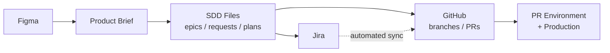
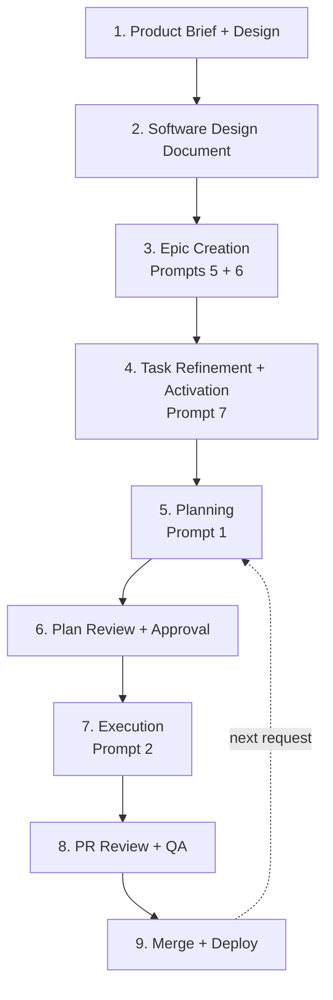
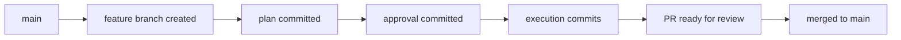
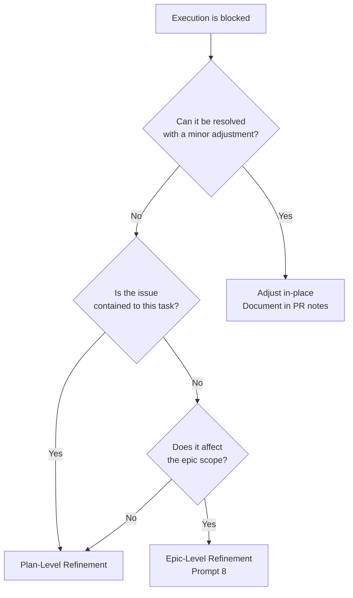
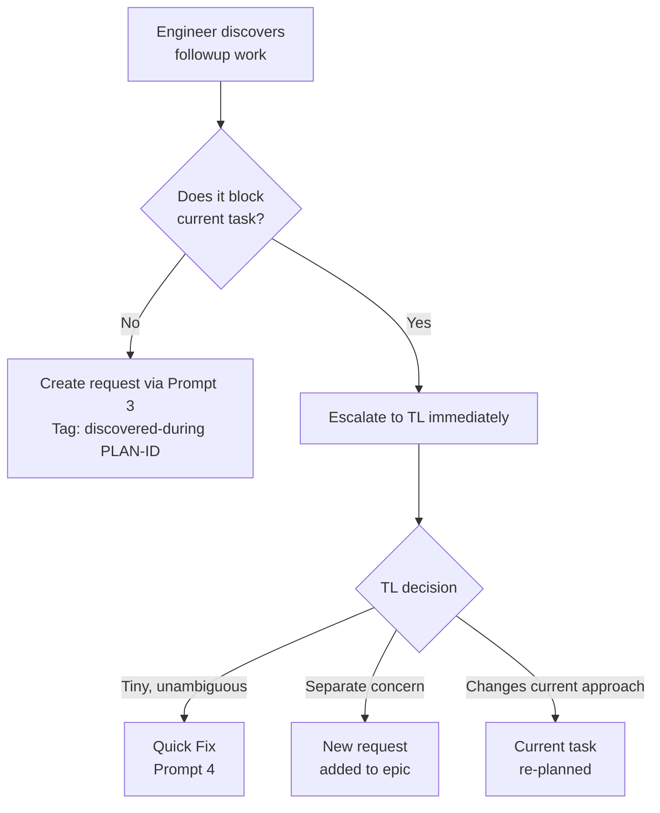

# Squad Flow: Figma → Jira → GitHub with SDD

This document describes the end-to-end delivery flow for squads using **Spec-Driven Development (SDD)** in a corporate environment with Figma, Jira, and GitHub as primary tooling.

It is a companion to [DEVELOPMENT-GUIDE.md](./DEVELOPMENT-GUIDE.md) — that document explains the *mechanics* of SDD (prompts, files, statuses). This document explains the *team choreography* — who does what, when, and how the tools connect.

> **Prerequisite:** GitHub Actions are configured in your org's repositories to sync PR lifecycle events to Jira (PR opened → In Progress; PR merged → Done). This document assumes that automation exists and does not repeat Jira transition instructions at each step.

---

## Table of Contents

- [Roles](#roles)
- [Tool Integration Map](#tool-integration-map)
- [The Main Flow](#the-main-flow)
- [Session Discipline](#session-discipline)
- [Branch & PR Strategy](#branch--pr-strategy)
- [Expected PR Contents](#expected-pr-contents)
- [Merge Conflict Guidance](#merge-conflict-guidance)
- [The Blocked Path](#the-blocked-path)
- [Discovering Followup Work](#discovering-followup-work)
- [Epic Amendments](#epic-amendments)
- [Definition of Done](#definition-of-done)
- [Quick Reference: Who Does What](#quick-reference-who-does-what)

---

## Roles

| Role | Abbreviation | Responsibilities in this flow |
|------|:---:|---|
| Product Manager | PM | Product brief, Figma designs, acceptance sign-off |
| Engineering Manager | EM | Epic definition, strategic prioritization |
| Tech Lead | TL | Epic breakdown, task refinement, plan review, scope decisions |
| Engineer | ENG | Plan approval, execution, PR creation, followup discovery |
| QA Engineer | QA | Verification in PR environments |

---

## Tool Integration Map



**Where things live:**

| Artifact | Primary location | Also linked from |
|----------|-----------------|-----------------|
| Product brief | Confluence / Notion / shared doc | `epic.md` references |
| Figma designs (feature-level) | Figma project | Product brief, `epic.md` references |
| Figma designs (component-level) | Figma project | Jira task tickets, request files |
| Epic definition | `epics/active/N-name/epic.md` | Jira Epic ticket |
| Task dependency graph | `epics/active/N-name/task-graph.md` | — |
| Individual requests | `epics/active/N-name/requests/` | Jira task tickets |
| Plans | Within the feature branch | PR diff |
| Delivery tracking | `epics/active/N-name/delivery.yaml` | — |

---

## The Main Flow



---

### Step 1 — Product Brief + Design

| | |
|---|---|
| **Who** | PM |
| **Input** | Business need, user research, competitive analysis |
| **Output** | Product brief document + Figma designs |
| **Tools** | Figma, Confluence/Notion |

The PM produces:
- A product brief covering: the problem, desired outcome, scope boundaries, success metrics
- Figma designs (wireframes or high-fidelity) showing the intended user experience

The brief can be any format (PRD, Confluence page, annotated Figma, Loom video) as long as it contains problem + outcome + scope signal. See [DEVELOPMENT-GUIDE § Input Requirements](./DEVELOPMENT-GUIDE.md#input-requirements-per-phase) for the full validity checklist.

**Figma integration:** Feature-level designs are linked in the product brief. These links will propagate to the epic and, where relevant, to individual Jira task tickets.

---

### Step 2 — Software Design Document

| | |
|---|---|
| **Who** | TL (with EM input) |
| **Input** | Product brief, Figma designs, existing architecture |
| **Output** | Technical design document |
| **Tools** | Confluence/Notion, codebase |

The TL produces a software design document covering:
- **Goals and non-goals** — what the project aims to achieve and explicitly what it does not
- **Project milestones** — key delivery checkpoints with rough time estimates
- **High-level architecture** — which system layers are affected
- **Data flow** — how data moves through the system
- **API contracts** — new or modified endpoints/schemas
- **Technical risks** — performance, migrations, breaking changes
- **Pattern decisions** — existing patterns to follow or deviate from
- **Rough estimation** — overall effort estimate (person-weeks or sprint count) to set expectations

This document feeds into Epic creation and prevents the agent from making unsupervised architectural decisions. Goals/non-goals and milestones are particularly important as they propagate into the epic's acceptance criteria and inform task prioritization during breakdown.

---

### Step 3 — Epic Creation

| | |
|---|---|
| **Who** | EM + TL (with agent) |
| **Input** | Product brief, software design document, Figma links |
| **Output** | `epic.md` + `task-graph.md` + `delivery.yaml` + request shells + Jira Epic |
| **Tools** | Agent (Prompts 5 → 6), Jira MCP |
| **Sessions** | One interactive session for Prompt 5, one fresh session for Prompt 6 |

**Prompt 5 (Interactive — 20-60 min):**
1. EM + TL open a fresh agent session
2. Provide: product brief, software design doc, Figma links
3. Engage in discovery — the agent asks clarifying questions, you answer
4. When discovery is complete, declare it done — agent writes `epic.md`

**Prompt 6 (One-shot):**
1. Open a fresh agent session
2. Agent reads the completed `epic.md` and produces:
   - `task-graph.md` with dependency DAG
   - `delivery.yaml` with PR structure
   - Request shells in `epics/active/N-name/requests/`
3. Agent creates the Jira Epic ticket via MCP

**End state:** Epic exists with status `decomposed`. Request shells exist for each task. Jira Epic is created.

---

### Step 4 — Task Refinement + Activation

| | |
|---|---|
| **Who** | TL + ENG (with agent) |
| **Input** | Request shells, codebase access, component-level Figma designs |
| **Output** | Full request documents (status: `activated`) + Jira task tickets |
| **Tools** | Agent (Prompt 7), Jira MCP |
| **Sessions** | One fresh interactive session per task (10-30 min each) |

The TL and the assigned engineer pair on refinement:

1. Open a fresh agent session per task
2. Use Prompt 7 — interactive refinement fills in technical details, answers key questions, establishes acceptance criteria
3. When complete, agent writes the full request and creates the Jira ticket
4. TL marks the request status as `activated` in the same session (since the team moves fast, activation happens immediately after refinement)

**Figma integration:** Component-level design links relevant to a specific task are included in the request file's context section and in the Jira ticket's description.

**Parallelism:** Multiple tasks can be refined in parallel sessions. If tasks have dependencies, note the execution order during refinement.

**End state:** All requests are `activated`. Jira tickets exist with full context, acceptance criteria, and design links. Development can begin.

---

### Step 5 — Planning

| | |
|---|---|
| **Who** | ENG (with agent) |
| **Input** | Activated request, agent-specs, codebase |
| **Output** | Plan folder (manifest + specification + stages) on a feature branch |
| **Tools** | Agent (Prompt 1), Git |
| **Session** | Fresh agent session |

1. Engineer opens a fresh agent session
2. Uses Prompt 1 — agent reads the request + agent-specs and produces the plan
3. Agent creates the branch from `main` following the naming convention, commits the plan folder, pushes, and opens a **draft PR** using the `gh` CLI:
   ```
   gh pr create --draft --title "plan: <ticket-id> <description>" --body "..."
   ```
4. If Figma designs are needed for the plan (component specs, spacing, states), engineer provides them during planning or links them in the specification

**End state:** Feature branch exists with the plan folder committed. Draft PR is open. Plan status is `pending-approval`.

---

### Step 6 — Plan Review + Approval

| | |
|---|---|
| **Who** | ENG (with TL review) |
| **Input** | Draft PR containing the plan folder |
| **Output** | Approved plan (approval fields set in `manifest.yaml`) |
| **Tools** | GitHub (PR review), editor |

1. Engineer reviews the draft PR (already opened by the agent in Step 5)
2. TL reviews the plan — specification, stages, open questions
3. Engineer and TL resolve all `PENDING` markers in `specification.md`
4. Engineer updates `manifest.yaml`: sets `approval.status: approved`, `approved_by`, `approved_at`
5. The approval commit is pushed to the same branch

**Alternative:** Engineer can approve directly on-branch if TL has already reviewed the plan during a pairing session or async review.

**End state:** Plan is approved on the feature branch. The branch is ready for execution.

---

### Step 7 — Execution

| | |
|---|---|
| **Who** | ENG (with agent) |
| **Input** | Approved plan on the feature branch |
| **Output** | Implemented code + updated docs + plan archived to `done/` |
| **Tools** | Agent (Prompt 2), Git |
| **Session** | Fresh agent session on the same feature branch |

1. Engineer opens a **new** agent session (not the planning session) on the feature branch
2. Uses Prompt 2 — agent verifies approval, then executes stages in order
3. Agent commits progressively (multiple commits per stage allowed)
4. After all stages complete, agent:
   - Updates spec/doc files as needed
   - Moves plan folder to `agent-development/done/plans/`
   - Moves request to `agent-development/done/requests/`
   - Marks the draft PR as ready for review

**End state:** PR is ready for review with all code changes, documentation updates, and archived plan files.

---

### Step 8 — PR Review + QA

| | |
|---|---|
| **Who** | ENG peers (code review) + QA (verification) |
| **Input** | Ready PR with PR environment |
| **Output** | Approved PR |
| **Tools** | GitHub, PR environment |

1. Engineers perform code review using the PR's Review Guide table (each commit maps to a plan stage) — this is standard peer review, not necessarily the TL
2. QA verifies acceptance criteria in the PR environment (auto-provisioned by existing CI/CD automation), including validation against Figma designs for UI work
3. Requested changes are addressed by the engineer (manually or with agent assistance)

**End state:** PR is approved and QA passes.

---

### Step 9 — Merge + Deploy

| | |
|---|---|
| **Who** | ENG |
| **Input** | Approved, QA-passed PR |
| **Output** | Code on main, deployed |
| **Tools** | GitHub, CI/CD |

1. Engineer merges the PR (squash merge per `teams.yaml` convention)
2. CI/CD deploys to the target environment
3. Engineer updates `delivery.yaml`: node status → `merged`
4. If all epic tasks are done, TL archives the epic to `epics/done/`

**End state:** Feature is live. Next request can begin at Step 5.

---

### Looping: Next Request

After a request is merged, the next activated request can immediately enter Step 5 (Planning). Multiple requests can be in-flight simultaneously — see [Branch & PR Strategy](#branch--pr-strategy) for parallel execution rules.

---

## Session Discipline

Each prompt should be used in a **fresh agent session**. This is not arbitrary — it's a deliberate practice:

| Reason | Explanation |
|--------|-------------|
| **Context clarity** | A fresh session starts with clean context. The agent reads exactly what it needs from files, not from stale conversation history. |
| **Audit boundaries** | Each session = one unit of work. If something goes wrong, you know which session caused it. |
| **Prompt fidelity** | Prompts are designed as self-contained instructions. Residual context from a prior task can cause the agent to conflate requirements. |
| **Reproducibility** | A fresh session given the same files will produce the same result. A continued session may drift. |

**The one exception:** During Step 6 (approval), if the engineer is already on the branch and wants to quickly ask the agent to update the approval fields, a short follow-up in the *planning* session is acceptable — the state hasn't changed.

**Rule of thumb:** If you're switching prompts (e.g., from Prompt 1 to Prompt 2), always start a fresh session.

---

## Branch & PR Strategy

### Single Branch Per Request

Each request follows a single branch lifecycle:



The plan, approval, and code all live on the same branch. One PR, one merge. The plan files serve as documentation within the PR diff — reviewers can see *what was planned* alongside *what was built*.

### Parallel Execution

Multiple requests can be in-flight on separate branches simultaneously. Rules:

1. **Independent tasks** (no edges in `task-graph.md`): develop in parallel freely
2. **Dependent tasks**: the downstream task should not begin execution until its dependency is merged to main
3. **Soft dependencies** (shared code areas but no strict ordering): develop in parallel, but the second-to-merge must rebase on main before merge — see [Merge Conflict Guidance](#merge-conflict-guidance)

The `delivery.yaml` `merge_order` groups define which tasks can safely proceed in parallel.

### Branch Naming

Per `config/teams.yaml`:
```
<type>/<ticket-id>-<short-description>
```

Examples:
- `feat/PROJ-123-add-user-notifications`
- `fix/PROJ-456-fix-login-redirect`
- `chore/PROJ-789-update-dependencies`

---

## Expected PR Contents

Understanding what a PR *should* contain helps reviewers focus and catch anomalies.

### Plan PR (Draft — Steps 5-6)

When the PR is first opened as a draft, it contains only plan artifacts:

| File type | Location | What to look for |
|-----------|----------|-----------------|
| `manifest.yaml` | `agent-development/plans/N-name/` or `epics/active/N/plans/N-name/` | Correct status, reasonable complexity estimates, stage breakdown |
| `specification.md` | Same folder | Clear overview, all open questions resolved (no `PENDING`), realistic pre-conditions |
| Stage files (`N-name.md`) | Same folder | Logical ordering, clear instructions, verification steps, rollback plans |
| Request file (unchanged) | `agent-development/pending/` or `epics/active/N/requests/` | Should NOT be modified during planning |

**Total expected files:** 3-8 (manifest + spec + stages)
**Expected change locations:** Only within the `sdd/` directory tree

### Execution PR (Ready for Review — Steps 7-8)

After execution completes, the PR additionally contains:

| File type | Location | What to look for |
|-----------|----------|-----------------|
| Source code changes | Application directories | Match the plan's stage instructions and blast radius |
| Test files | Test directories | Coverage for new/changed behavior |
| Spec updates | `agent-development/agent-specs/` | Architecture/instructions updated if the task introduced new patterns |
| Documentation | `README.md`, user docs | Updated if user-facing behavior changed |
| Archived plan | `agent-development/done/plans/N-name/` | Plan moved from `plans/` to `done/plans/` |
| Archived request | `agent-development/done/requests/N-name.md` | Request moved from `pending/` to `done/requests/` |
| Updated `delivery.yaml` | `epics/active/N-name/` (epic tasks only) | Node status updated to `ready-for-review` |

**What should NOT be in an execution PR:**
- Changes to files outside the plan's declared blast radius (without explanation)
- Modifications to other requests or plans
- Version bumps (handled separately)
- Unrelated refactors or fixes (those become followup requests)

---

## Merge Conflict Guidance

When multiple requests execute in parallel, merge conflicts are possible. Follow these rules:

### Prevention

1. **Respect the dependency graph.** If `task-graph.md` shows A → B, do not start B's execution until A is merged.
2. **Check `delivery.yaml` merge groups.** Tasks in the same merge group are designed to be conflict-free. Tasks in different groups may conflict.
3. **During planning (Prompt 1),** review the blast radius of sibling in-flight tasks. If overlap is detected, note it in the plan's specification and establish merge order.

### Resolution

When conflicts arise despite prevention:

1. **The second-to-merge rebases on main.** After the first PR merges, the remaining branch must rebase:
   ```
   git fetch origin
   git rebase origin/main
   ```
2. **Resolve conflicts using the plan as guide.** The plan's stage files describe *intent*. Use that intent to resolve conflicts correctly.
3. **Re-run verification.** After conflict resolution, all verification commands from the plan's stages must pass again.
4. **Document in `delivery.yaml`.** Record the conflict and resolution in the `incidents[]` section:
   ```yaml
   incidents:
     - date: 2026-05-20
       description: "Merge conflict with PR #123 in shared-component.tsx"
       resolution: "Rebased on main, preserved both features' logic in component"
   ```

**Agent-assisted resolution:** When conflicts are straightforward (import changes, file renames, additive changes in the same file), the engineer can open a fresh agent session to perform the rebase and conflict resolution. Provide the agent with the plan's specification and the conflicting file context — the agent can resolve, re-run verification commands, and push the rebased branch. Reserve manual resolution for semantic conflicts where human judgment is needed.

### When Conflicts Are Too Large

If a rebase produces conflicts across many files or fundamentally changes the execution context:

1. **Stop.** Do not force-resolve complex conflicts.
2. **Inform the TL.** This may indicate a missing dependency edge in the task graph.
3. **Options:**
   - Re-plan the conflicting task (new Prompt 1 session on a fresh branch from current main)
   - Add the missing dependency to `task-graph.md` and sequence future work accordingly
   - Split the conflicting area into its own request

---

## The Blocked Path

Execution doesn't always go smoothly. When a plan cannot be completed as written, the engineer must decide the appropriate escalation level.

### Decision Tree



### Minor Adjustment (Stay on course)

**When:** The blocker is small — a function signature changed, a file moved, a dependency version differs from what was planned.

**Action:**
- Engineer resolves it during execution
- Documents the deviation in the PR description under "Key Decisions"
- No re-planning needed

### Plan-Level Refinement

**When:** An open question answer substantially changes the plan's approach, or execution reveals the plan is fundamentally wrong for *this specific task*.

**Triggers:**
- A planned approach proves technically infeasible
- A dependency doesn't behave as documented
- The plan surfaces a prerequisite that must be built first (→ followup request)
- Verification commands fail in ways that indicate design issues, not bugs

**Process:**
1. Engineer **stops execution** on the current branch
2. Engineer informs TL of the situation and what was discovered
3. Engineer discards the in-progress execution commits (plan commits stay):
   ```
   git reset --hard <last-plan-commit>
   ```
4. Opens a fresh agent session, re-runs Prompt 1 with updated context (the original request + what was learned)
5. New plan replaces the old plan on the same branch
6. Review and approval cycle repeats (Steps 6-7)

**If a followup request is needed:**
- Engineer uses Prompt 3 to create the new request
- TL adds it to the epic via amendment (Prompt 8) or as a standalone if it's independent
- The new request enters the pipeline at Step 5

### Epic-Level Refinement (Prompt 8)

**When:** The issue affects multiple tasks, changes acceptance criteria, or invalidates the epic's assumptions.

**Triggers:**
- Design changes from PM/Figma that affect multiple tasks
- A technical limitation that constrains the entire feature (e.g., "this API doesn't support X, we need a different approach for all tasks")
- Requirements changes from stakeholders
- Discovery that the task breakdown itself is wrong (wrong boundaries, missing tasks)

**Process:**
1. Engineer **stops execution** and informs both TL and EM immediately
2. TL, EM, and the engineer collaborate on the refinement (can be async via comments/threads or sync via a short call)
3. TL opens a fresh agent session and uses Prompt 8 (interactive amendment), incorporating input from all parties
4. Agent assesses impact, proposes minimal changes, records negotiation
5. Updates cascade: `task-graph.md`, `delivery.yaml`, affected request files, Jira tickets
6. Affected in-flight tasks must be re-evaluated:
   - If only scope text changed → continue execution with adjusted requirements
   - If dependencies changed → may need to pause and wait
   - If the task itself was split or removed → close the branch, start fresh

**Visibility:** Every amendment is recorded in `task-graph.md` `negotiations[]` and `delivery.yaml` `negotiation_impacts[]`. This gives the EM and PM visibility into scope evolution.

---

## Discovering Followup Work

During planning or execution, engineers frequently discover work that is adjacent to but outside the current task's scope. This is expected and healthy — SDD's explicit blast radius makes it easy to spot.

### Types of Followup

| Type | Example | Urgency |
|------|---------|---------|
| **Tech debt** | "This module has no tests and I'm building on it" | Low — queue it |
| **Prerequisite** | "I need a shared utility that doesn't exist yet" | High — blocks current work |
| **Adjacent feature** | "While here I noticed we could also add X" | None — resist scope creep |
| **Bug** | "This existing code has a bug I tripped over" | Medium — depends on severity |
| **Missing spec** | "The architecture doc doesn't cover this area" | Low — include in current task's spec-update stage |

### Process



### Non-Blocking Followups

1. Engineer creates a request using Prompt 3 in a **separate** agent session
2. Tags the request with `discovered_during: <plan-id>` in the frontmatter
3. Request goes into `agent-development/pending/` (standalone) or is added to the epic via TL
4. Engineer continues current execution uninterrupted
5. TL triages the followup during next prioritization

### Blocking Followups (Prerequisites)

1. Engineer stops and immediately notifies TL
2. TL decides:
   - **If small enough for a quick fix:** Engineer uses Prompt 4 to resolve it first, then resumes execution
   - **If it's a real task:** TL amends the epic (Prompt 8) to add the prerequisite, updates dependency graph, and the new task goes through the full pipeline first
   - **If it changes the current plan:** Engineer follows the [Plan-Level Refinement](#plan-level-refinement) path

### Documentation

All discovered followups should be documented:
- **In the current PR:** Add a "Discovered Work" section to the PR description listing items found
- **In the followup request:** Reference the discovering plan with `discovered_during`
- **In `delivery.yaml`:** If the followup becomes part of the epic, it appears in the updated graph

---

## Epic Amendments

When an epic's scope must change after it's already active, use the formal amendment path rather than ad-hoc edits. This preserves the audit trail and ensures all downstream artifacts stay consistent.

### When to Amend

- PM delivers revised requirements or updated Figma designs
- A completed task reveals that subsequent tasks need different scope
- Engineering policy changes affect the implementation approach
- A task proves too large and must be split
- External dependencies (APIs, vendors) change constraints

### Amendment Flow

1. **TL opens fresh session** with Prompt 8 (interactive)
2. **Describes the change trigger** — what happened and why scope must change
3. **Agent assesses impact:**
   - Which tasks are affected?
   - What's the blast radius on the dependency graph?
   - Are any in-progress tasks impacted?
4. **Agent proposes minimal changes** — the goal is surgical, not a rewrite
5. **TL approves the proposal** — agent writes updates:
   - `task-graph.md`: new/modified tasks, updated edges, negotiation record
   - `delivery.yaml`: new nodes, resequenced merge order, negotiation impact
   - Request files: updated scope, acceptance criteria
   - Jira: new tickets created, existing tickets updated (via MCP)
6. **Cascading effects:**
   - In-progress tasks with minor scope changes → engineer adjusts plan
   - In-progress tasks with major scope changes → stop execution, re-plan
   - New tasks → enter pipeline at Step 4 (refinement)
   - Completed tasks are **never modified** — if rework is needed, create a new task

### Rules

- Existing task IDs never change — new tasks get the next sequential ID
- Epic status goes `active` → `renegotiating` → `active`
- Every amendment gets a negotiation entry with: trigger, type, original scope, revised scope, rationale, decided_by

---

## Definition of Done

### Task-Level Done

A task/request is "done" when:

- [ ] All plan stages executed successfully (verification commands pass)
- [ ] PR is approved by TL (code review)
- [ ] QA passes in PR environment
- [ ] PR is merged to main
- [ ] Plan and request archived to `done/`
- [ ] `delivery.yaml` node status: `merged`
- [ ] Jira ticket transitions to Done (automated via GitHub Actions)

### Epic-Level Done

An epic is "done" when:

- [ ] All tasks in `task-graph.md` have status `done` or `skipped`
- [ ] All nodes in `delivery.yaml` have status `merged` or `abandoned`
- [ ] PM performs acceptance sign-off against the original product brief and Figma designs
- [ ] The feature is deployed to production and confirmed working
- [ ] Epic folder is moved to `epics/done/`
- [ ] Jira Epic is transitioned to Done

### Establishing Done Criteria

The **Definition of Done** for an epic should be established during Epic Creation (Step 3, Prompt 5). During the interactive discovery session, the TL and EM should define:

- What constitutes "production-ready" for this feature
- Whether staged rollout / feature flags are part of done
- Whether analytics/monitoring must be confirmed
- Whether documentation or training materials are required before closure
- Specific metrics or thresholds that indicate success (if applicable)

These criteria are captured in the `epic.md` acceptance section and flow down to individual task acceptance criteria during refinement.

---

## Quick Reference: Who Does What

| Step | PM | EM | TL | ENG | Agent | Tool |
|------|:--:|:--:|:--:|:---:|:-----:|------|
| 1. Product Brief | ✍️ | — | C | — | — | Figma, Confluence |
| 2. Software Design | — | C | ✍️ | — | — | Confluence |
| 3. Epic Creation | C | ✍️ | ✍️ | — | 🤖 | Prompts 5+6, Jira MCP |
| 4. Task Refinement | — | — | ✍️ | ✍️ | 🤖 | Prompt 7, Jira MCP |
| 5. Planning | — | — | — | ✍️ | 🤖 | Prompt 1, Git |
| 6. Plan Approval | — | — | 👁️ | ✍️ | — | GitHub PR |
| 7. Execution | — | — | — | ✍️ | 🤖 | Prompt 2, Git |
| 8. Review + QA | — | — | — | 👁️ | — | GitHub PR, PR Env |
| 9. Merge + Deploy | — | — | — | ✍️ | — | GitHub, CI/CD |

_✍️ = performs the work, 👁️ = reviews, C = consulted, 🤖 = agent assists_

---

## Appendix: Flow Variants

### Standalone Tasks (No Epic)

For work that doesn't belong to an epic (one-off fixes, small features, tech debt):

1. TL or ENG creates request via Prompt 3 → `agent-development/pending/`
2. Flow continues from Step 5 (Planning) onwards
3. No `delivery.yaml` coordination needed — the plan's own `manifest.yaml` tracks delivery

### Quick Fixes

For trivial changes (1-3 files, no ambiguity):

1. ENG uses Prompt 4 in a fresh session
2. Agent implements, verifies, produces log file
3. No plan, no approval gate, no PR review beyond standard CI
4. If the agent discovers the change is too large → stops and recommends full pipeline

### Hotfixes (Post-Deploy Issues)

When production breaks after a merge:

1. If the fix is trivial and obvious → Quick Fix Track (Prompt 4) directly on a `hotfix/` branch
2. If the fix requires investigation → new request (Prompt 3), expedited through the pipeline
3. If a rollback is needed → revert the merge commit, then investigate via normal flow
