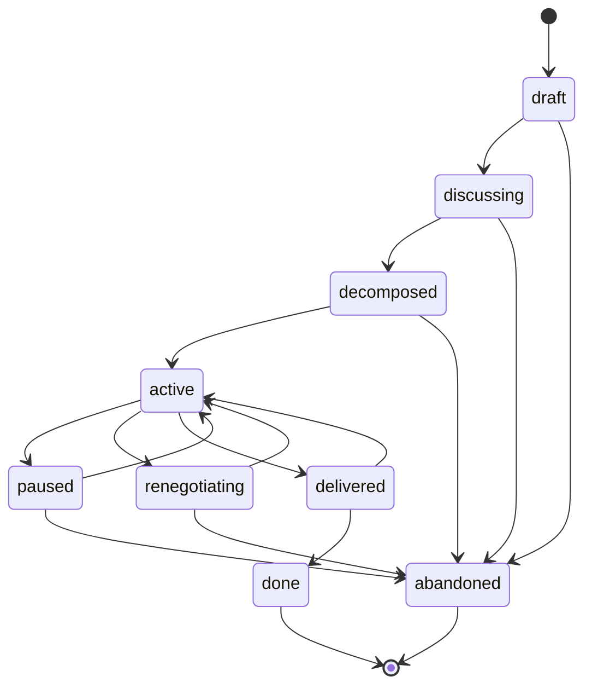
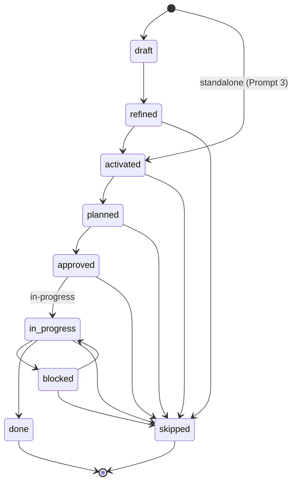
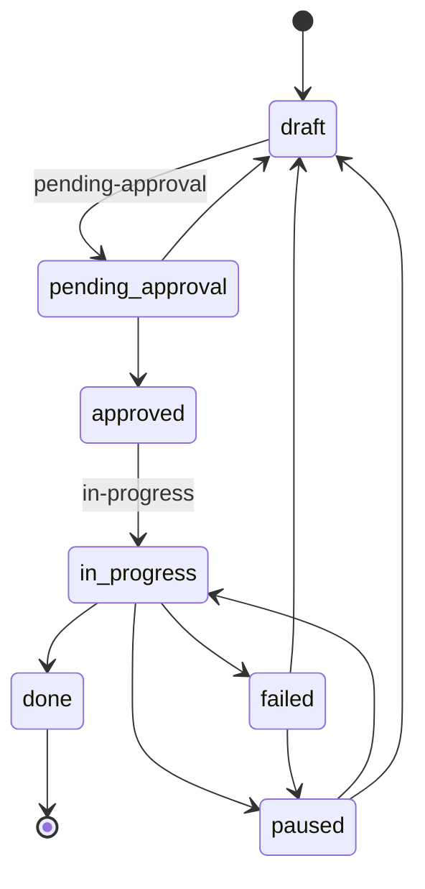
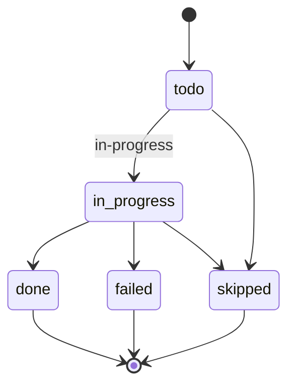
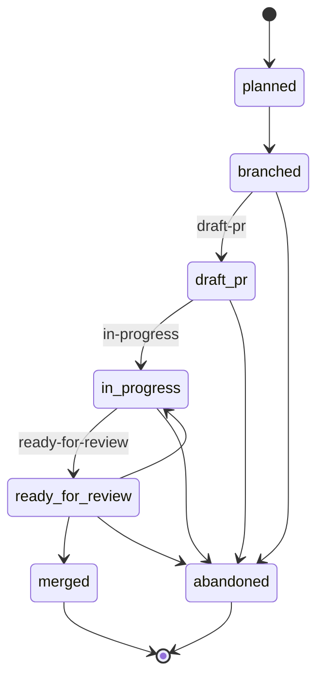
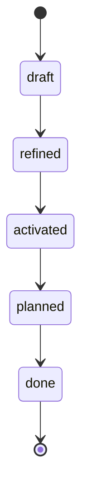

# Status Reference — SDD Workflow System

> **Canonical reference for all status enums, complexity scales, and state transitions used in the iterative workflow.**

This document defines every valid status value across all workflow layers. Use it to understand where an artifact is in its lifecycle, who can transition it, and what transitions are legal.

---

## How to Read This Document

Each layer section includes:

- **Status table** — every value, its meaning, who transitions it, and what comes next
- **Transition diagram** — a Mermaid state chart showing valid moves between statuses

Statuses are always lowercase, hyphenated strings stored in YAML frontmatter or manifest files. They are never inferred from file location (see [Approval is Field-Based](#approval-is-field-based) below).

---

## Epic Statuses

Epics track large initiatives from ideation through completion.

| Status | Meaning | Transitioned by | Next statuses |
|--------|---------|-----------------|---------------|
| `draft` | Initial capture of an idea; incomplete | Human | `discussing`, `abandoned` |
| `discussing` | Under active discussion and refinement | Human | `decomposed`, `abandoned` |
| `decomposed` | Broken into tasks; task graph exists | Human / Agent | `active`, `abandoned` |
| `active` | Work is in progress on child tasks | Human / Agent | `paused`, `renegotiating`, `delivered` |
| `paused` | Temporarily halted (external blocker, priority shift) | Human | `active`, `abandoned` |
| `renegotiating` | Scope or direction being revised mid-flight | Human | `active`, `abandoned` |
| `delivered` | All tasks complete; awaiting final sign-off | Agent / Human | `done`, `active` |
| `done` | Fully complete and accepted | Human | _(terminal)_ |
| `abandoned` | Cancelled; will not be completed | Human | _(terminal)_ |



---

## Task Statuses

Tasks are the atomic units of work within an epic. Status is tracked in the `task-graph.md` frontmatter.

| Status | Meaning | Transitioned by | Next statuses |
|--------|---------|-----------------|---------------|
| `draft` | Captured but not yet fully specified | Human / Agent | `refined` |
| `refined` | Requirements and scope are clear | Human / Agent | `activated`, `skipped` |
| `activated` | Ready for planning; dependencies met | Agent | `planned`, `skipped` |
| `planned` | Has an execution plan (manifest exists) | Agent | `approved`, `skipped` |
| `approved` | Plan reviewed and approved for execution | Human | `in-progress`, `skipped` |
| `in-progress` | Actively being worked on | Agent | `blocked`, `done`, `skipped` |
| `blocked` | Cannot proceed (missing info, dependency) | Agent / Human | `in-progress`, `skipped` |
| `done` | Completed and verified | Agent / Human | _(terminal)_ |
| `skipped` | Will not be done (out of scope, superseded) | Human | _(terminal)_ |

> **Shortcut:** Standalone requests created via Prompt 3 (interactive discovery) enter directly at `activated` status, skipping `draft` and `refined` — the interactive session itself serves as the refinement process.



---

## Plan Statuses

Plans (stored in `manifest.yaml`) describe how a task will be executed. They go through an approval cycle before work begins.

| Status | Meaning | Transitioned by | Next statuses |
|--------|---------|-----------------|---------------|
| `draft` | Plan is being authored | Agent | `pending-approval` |
| `pending-approval` | Submitted for human review | Agent | `approved`, `draft` |
| `approved` | Human has signed off on the approach | Human | `in-progress` |
| `in-progress` | Execution has started | Agent | `done`, `failed`, `paused` |
| `done` | All stages completed successfully | Agent | _(terminal)_ |
| `failed` | Execution failed; requires intervention | Agent | `draft`, `paused` |
| `paused` | Execution halted mid-flight | Human / Agent | `in-progress`, `draft` |



---

## Stage Statuses

Stages are ordered steps within a plan (`manifest.yaml → stages[]`). They execute sequentially.

| Status | Meaning | Transitioned by | Next statuses |
|--------|---------|-----------------|---------------|
| `todo` | Not yet started | _(initial)_ | `in-progress`, `skipped` |
| `in-progress` | Currently being executed | Agent | `done`, `failed`, `skipped` |
| `done` | Completed successfully | Agent | _(terminal)_ |
| `skipped` | Will not be executed (e.g., not applicable) | Agent / Human | _(terminal)_ |
| `failed` | Execution failed at this stage | Agent | _(terminal — triggers plan-level failure)_ |



---

## Delivery Node Statuses

Delivery nodes (in `delivery.yaml`) track individual pull requests or merge units from branch creation through merge.

| Status | Meaning | Transitioned by | Next statuses |
|--------|---------|-----------------|---------------|
| `planned` | PR is defined but branch not yet created | Agent | `branched` |
| `branched` | Branch exists; no PR yet | Agent | `draft-pr`, `abandoned` |
| `draft-pr` | Draft PR opened; work in progress | Agent | `in-progress`, `abandoned` |
| `in-progress` | PR is being actively developed | Agent | `ready-for-review`, `abandoned` |
| `ready-for-review` | PR is complete and awaiting review | Agent | `merged`, `in-progress`, `abandoned` |
| `merged` | PR has been merged to target branch | Human / CI | _(terminal)_ |
| `abandoned` | PR will not be merged; branch may be deleted | Human / Agent | _(terminal)_ |



---

## Request Statuses

Requests are the initial ask from a human that may spawn an epic or standalone task. Status is tracked in the request file's YAML frontmatter.

| Status | Meaning | Transitioned by | Next statuses |
|--------|---------|-----------------|---------------|
| `draft` | Initial capture; may be incomplete | Human | `refined` |
| `refined` | Fully specified and ready for action | Human / Agent | `activated` |
| `activated` | Accepted and linked to an epic or task | Human | `planned` |
| `planned` | Execution plan exists | Agent | `done` |
| `done` | Request has been fulfilled | Agent / Human | _(terminal)_ |



---

## Fibonacci Complexity Scale

Task complexity is estimated using a Fibonacci scale. This is set in the task's frontmatter as a `complexity` field.

| Value | Label | Description | Example |
|-------|-------|-------------|---------|
| **1** | Trivial | Single-file tweak, rename, config change | Update an env variable name, fix a typo in a string |
| **2** | Small | 1–2 files, no design decisions needed | Add a new field to an existing DTO and its test |
| **3** | Medium | 3–5 files, one clear approach | Add a new resolver method with service logic and tests |
| **5** | Large | 5–10 files, some design decisions | Implement a new CRUD module with validation and error handling |
| **8** | Very Large | Many files, cross-cutting concerns — **consider splitting** | Refactor auth system, add new integration with external API |
| **13** | Epic-sized | **Must be split** — not a valid task complexity | Full feature with UI, API, DB, migrations, and docs |

### Guidelines

- **1–5** are valid task complexities for a single PR.
- **8** is a warning: the task likely benefits from decomposition into 2–3 smaller tasks.
- **13** means the item is an epic, not a task. Decompose it before estimating child tasks.
- When in doubt, round **up** — it's better to over-estimate and finish early than to under-estimate and blow deadlines.
- Re-estimate after refinement. A task that looked like a `5` during drafting may become a `3` once the approach is clear.

---

## Approval is Field-Based

> **Key principle:** Approval and status are tracked via fields in YAML frontmatter — NOT by moving files between folders.

### How it works

- Every workflow artifact (epic, task, plan, delivery node) has a `status` field in its YAML frontmatter or manifest.
- Transitioning status means **editing that field in place**. The file stays where it is.
- Tools like `bin/dev wf:status` read these fields to report on workflow state.
- Human approval is recorded by changing `status: pending-approval` → `status: approved` in the manifest.

### The only physical move: archiving

The **sole exception** is archiving completed work. When an epic reaches `done` status:

```bash
bin/dev wf:archive <epic-id>
```

This moves the epic's directory to `done/`, updates its status, and commits the change. This is the only time files move between folders as part of a status transition.

### Why field-based?

| Approach | Problem |
|----------|---------|
| Folder-based (`drafts/` → `approved/` → `done/`) | Breaks file references, makes git history hard to follow, complicates tooling |
| Field-based (status in frontmatter) | Files are stable, `git log --follow` works, tools can query status with simple YAML parsing |

### Practical implications

- **Never** move a task file to signal approval — edit its `status` field instead.
- **Never** infer status from a file's directory path (except `done/` which implies archival).
- **Always** use `bin/dev wf:status` or read frontmatter directly to determine current state.
